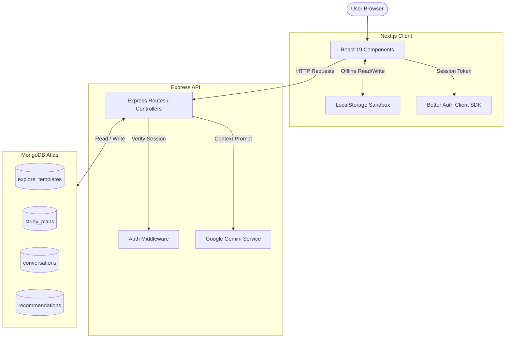
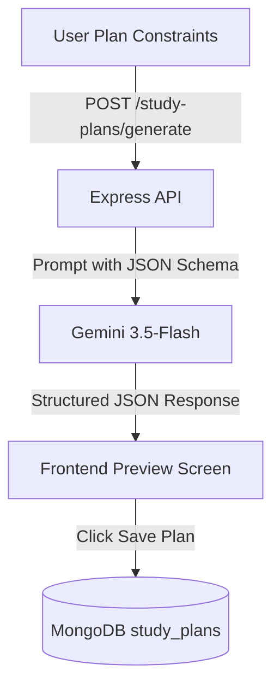
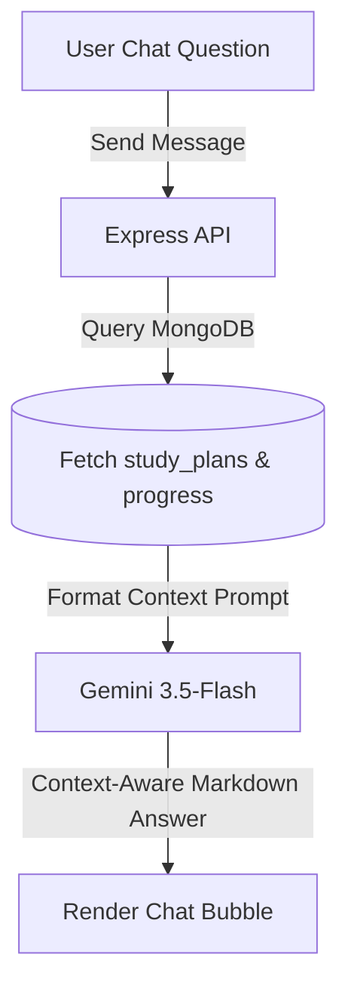
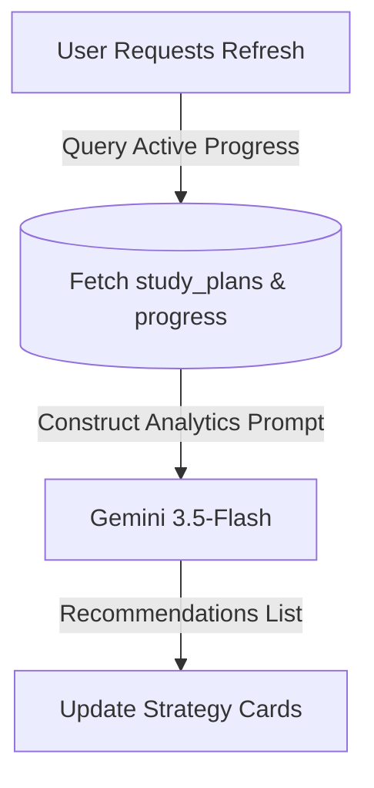

# StudyPilot AI — Backend API

[](https://nodejs.org)
[](https://expressjs.com)
[](https://www.mongodb.com/cloud/atlas)
[](https://deepmind.google/technologies/gemini)

StudyPilot AI Backend is an Express.js REST API built in TypeScript. It serves as the core coordinator for the platform, managing database access to MongoDB Atlas, route authentication, email services via Resend, and API integrations with Google Gemini (`gemini-3.5-flash`) for AI features.

This repository contains the backend server codebase.

---

## Table of Contents
- [1. Backend Architecture](#1-backend-architecture)
- [2. System Architecture & Flows](#2-system-architecture--flows)
- [3. Core Responsibilities](#3-core-responsibilities)
- [4. API Endpoint Catalog](#4-api-endpoint-catalog)
- [5. Database Schema Design](#5-database-schema-design)
- [6. Agentic AI Workflows](#6-agentic-ai-workflows)
  - [AI Study Planner](#ai-study-planner)
  - [AI Tutor Context Engine](#ai-tutor-context-engine)
  - [AI Recommendation Analytics](#ai-recommendation-analytics)
- [7. Error Handling & Diagnostics](#7-error-handling--diagnostics)
- [8. Contact & Mail Dispatch (Resend Integration)](#8-contact-&-mail-dispatch-resend-integration)
- [9. Environmental Variables](#9-environmental-variables)
- [10. Local Setup & Seeding](#10-local-setup--&-seeding)
- [11. Production Deployment & Security](#11-production-deployment-&-security)
- [12. Assignment Compliance Matrix](#12-known-limitations-&-roadmap)

---

## 1. Backend Architecture

```
┌────────────────────────────────────────────────────────┐
│                  STUDYPILOT AI SERVER                  │
├──────────────────────────┬─────────────────────────────┤
│   EXPRESS ROUTE PORTS    │    PERSISTENT STORAGE DATA  │
│                          │                             │
│   - /api/templates       │    - explore_templates      │
│   - /api/study-plans     │    - study_plans            │
│   - /api/conversations   │    - recommendations        │
│   - /api/recommendations │                             │
└──────────────────────────┴─────────────────────────────┘
```

The server manages all authenticated state transitions, coordinates database queries, and executes AI generation prompts. Standalone client features (such as "My Items") operate independently via client-side `localStorage` and bypass the Express server entirely to ensure clean data isolation.

---

## 2. System Architecture & Flows

### Overall System Architecture


---

## 3. Core Responsibilities

* **Auth Verification**: Intercepts request headers to validate active Better Auth sessions and route payloads.
* **Seeded Catalog**: Serves search-ready blueprints from the `explore_templates` database collection.
* **AI Plan Generation**: Integrates the Gemini API, using strict JSON schemas to generate structured study roadmaps.
* **Contextual AI Chat (Tutor)**: Compiles active study plans and task completion histories from MongoDB into context prompts for the AI.
* **Recommendations Engine**: Compiles student checkpoints and calculates progress metrics to generate personalized tips.
* **Error Sanitization**: Sanitizes stack traces in production while returning detailed diagnostics in development mode.

---

## 4. API Endpoint Catalog

All routes are prefixed with `/api`. Protected routes require a valid Better Auth session header.

### Explore Blueprints Catalog
| Method | Route | Auth | Payload | Purpose |
| --- | --- | --- | --- | --- |
| **GET** | `/api/templates` | Public | None | Paginated template search list. |
| **GET** | `/api/templates/:id` | Public | None | Retrieve details of a blueprint template. |

### AI Study Plans
| Method | Route | Auth | Payload | Purpose |
| --- | --- | --- | --- | --- |
| **POST** | `/api/study-plans/generate` | Required | Plan constraints | Generates structured JSON roadmap from Gemini. |
| **POST** | `/api/study-plans` | Required | Reconstructed JSON | Saves generated plan to MongoDB `study_plans`. |
| **GET** | `/api/study-plans` | Required | None | Fetch all plans for the logged-in user. |
| **PATCH** | `/api/study-plans/:planId/tasks/:taskId` | Required | `{ "completed": boolean }` | Updates task completion status. |
| **DELETE** | `/api/study-plans/:id` | Required | None | Removes a saved plan from the database. |

### AI Tutor Chat
| Method | Route | Auth | Payload | Purpose |
| --- | --- | --- | --- | --- |
| **POST** | `/api/conversations` | Required | Chat title | Opens a new conversation thread. |
| **GET** | `/api/conversations` | Required | None | Fetch user conversation history threads. |
| **POST** | `/api/conversations/:id/messages` | Required | `{ "content": string }` | Sends query and returns a context-aware AI response. |
| **DELETE** | `/api/conversations/:id` | Required | None | Removes a chat conversation thread. |

### AI Recommendations
| Method | Route | Auth | Payload | Purpose |
| --- | --- | --- | --- | --- |
| **GET** | `/api/recommendations` | Required | None | Retrieve user-specific study recommendations. |
| **POST** | `/api/recommendations/refresh` | Required | None | Re-analyze checklist progress to update recommendations. |

---

## 5. Database Schema Design

### Collection `explore_templates`
```typescript
interface ExploreTemplate {
  _id: ObjectId;
  title: string;
  description: string;
  category: string;
  difficulty: "Beginner" | "Intermediate" | "Advanced";
  duration: string;
  rating: number;
  tasks: string[];
}
```

### Collection `study_plans`
```typescript
interface StudyPlan {
  _id: ObjectId;
  userId: string;
  subject: string;
  description: string; // Enforces structured roadmap, dailySchedule, revisionStrategy
  examDate: Date;
  completed: boolean;
  createdAt: Date;
}
```

---

## 6. Agentic AI Workflows

### AI Study Planner
Generates structured roadmaps with task schedules and revision strategies.



* **Schema Enforcement**: Configures the Gemini request using `responseMimeType: "application/json"` and a strict `responseSchema` mapping phases, tasks, estimates, and schedules.
* **Compatibility Fallbacks**: Backend sanitization filters strip code fences (e.g. ` ```json `) to ensure robust JSON parsing.

### AI Tutor Context Engine
Compiles the user's active plans and checklist completion states into context prompts for the AI.



### AI Recommendation Analytics
Monitors progress ratios and pending tasks to generate personalized study targets.



---

## 7. Error Handling & Diagnostics

The server standardizes response formats for client-side error handling:
* **`CONFIG_ERROR`**: Indicates a missing Gemini API key or database configuration.
* **`AI_PROVIDER_ERROR`**: Indicates an upstream execution failure from the Google Gemini API.
* **`AI_EMPTY_RESPONSE`**: Indicates that the AI returned an empty response.

---

## 8. Contact & Mail Dispatch (Resend Integration)

Contact requests are handled by the contact controller:
* If a valid `RESEND_API_KEY` is configured, it sends an email confirmation.
* If the API key is missing or set to a placeholder, it runs in **Mock Mode**, logging details to the console and returning a success state to the client.

---

## 9. Environmental Variables

Create a `StudyPilot-AI-Server/.env` file:
```env
PORT=5000
MONGODB_URI=mongodb+srv://<user>:<password>@cluster.mongodb.net/studypilot_ai
GEMINI_API_KEY=AIzaSy...
FRONTEND_URL=http://localhost:3000
RESEND_API_KEY=re_...
```
* **PORT**: Port on which the API server runs.
* **MONGODB_URI**: Connection string for MongoDB Atlas.
* **GEMINI_API_KEY**: API key for Google Gemini.
* **FRONTEND_URL**: CORS domain configurations matching client app ports.
* **RESEND_API_KEY**: API key for Resend email dispatch.

---

## 10. Local Setup & Seeding

1. Clone the repository and navigate to the project folder.
2. Install dependencies:
   ```bash
   npm install
   ```
3. Seed the catalog with 100 template guides:
   ```bash
   npm run seed
   ```
4. Start the local server:
   ```bash
   npm run dev
   ```
5. The API endpoints will be accessible at [http://localhost:5000](http://localhost:5000).

---

## 11. Production Deployment & Security

Deploy the Express server using platform runners (like **Render**, **Railway**, or **Heroku**):
```bash
# Compile TS to JS modules
npm run build

# Start production build server
npm run start
```
* Ensure `FRONTEND_URL` is set to your production frontend domain to authorize CORS requests.
* Production error logs suppress raw stack traces to protect database structural schemas.

---

## 12. Assignment Compliance Matrix

* **Runtime & Storage**: Node.js, Express, and MongoDB Atlas.
* **Data Seed**: Includes a database seed script (`npm run seed`) that loads 100 templates.
* **Agentic Workflows**: Integrated Gemini 3.5-Flash for planners, tutor chat, and recommendations.
